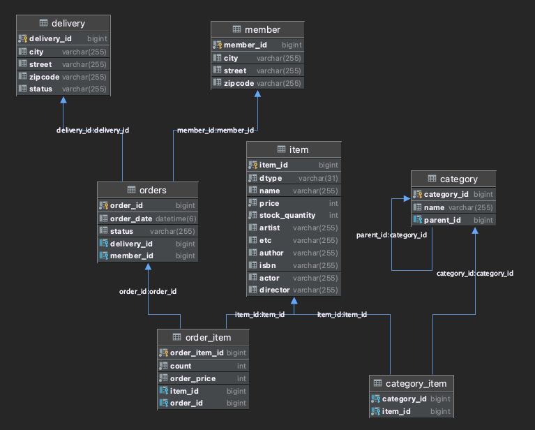

# JPAShop project

Spring boot, JPA를 활용 간단한 쇼핑웹 구현

## 학습목표

- JPA기본 강의 이론을 활용
- 예제를 통해 핵심 내용 정리

## 요구사항

- [ ] 회원 기능
    - [ ] 회원 가입
    - [ ] 회원 목록 조회
- [ ] 상품 기능
    - [ ] 상품 등록
    - [ ] 상품 수정
    - [ ] 상품 조회
- [ ] 주문기능
    - [ ] 상품 주문
    - [ ] 주문 내역 조회, 검색
    - [ ] 주문 취소

- [ ] 상품은 재고 관리해야 한다.
- [ ] 상품 종류 : 도서, 음반, 영화
- [ ] 상품을 카테고리로 구분
- [ ] 상품 주문시 배송정보 입력 가능

## Entity 구성

## 핵심 이론 정리

//TODO
